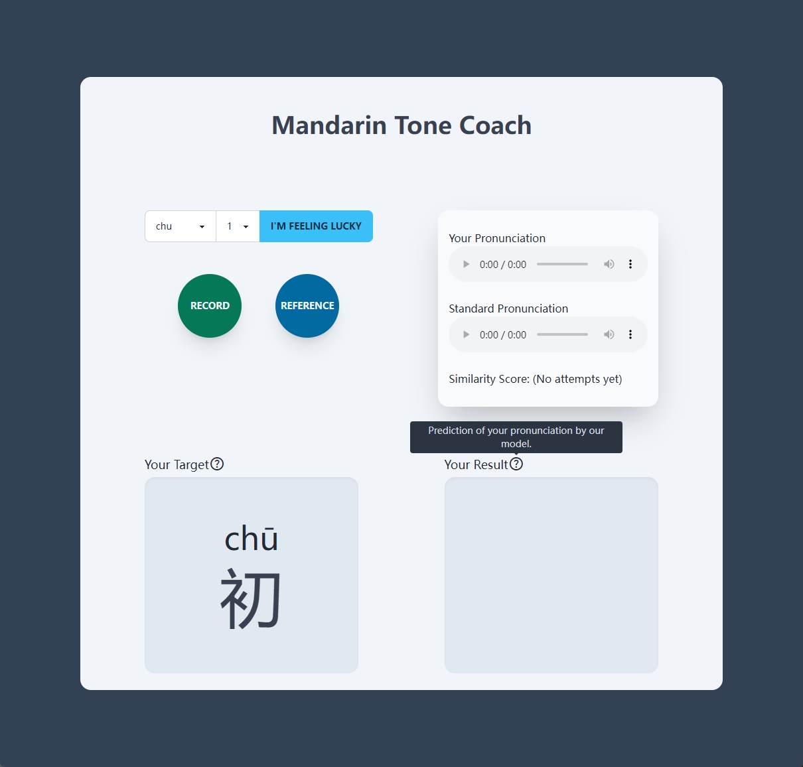

This repository contains the demo for the course project of CS5647. To run the demo, please ensure you have Python and Node.js and yarn installed.

### Set Up Environment

- Run following commands in your desired environment.

  ```bash
  cd server/inference/ && pip install -r requirements.txt
  cd ../ && yarn install
  cd ../client/ && yarn install
  ```

### Test the Server

* In `server/`, run
  ```bash
  yarn dev
  ```

### Test the Client

* In `client/`, run

  ```bash
  yarn dev
  ```
* Open the browser and direct to `localhost:5173`

### Interact with the Demo



- Choose the Pinyin and tone conbination you wish to practive or get a random one by clicking "I'm feeling lucky".
- Click REFERENCE button to hear standard pronunciation by TTS.
- Click RECORD button to input your own voice. The time limit is 3 seconds. You may have to grant the permission to use your microphone.
- Review your input or reference audio on the right panel.
